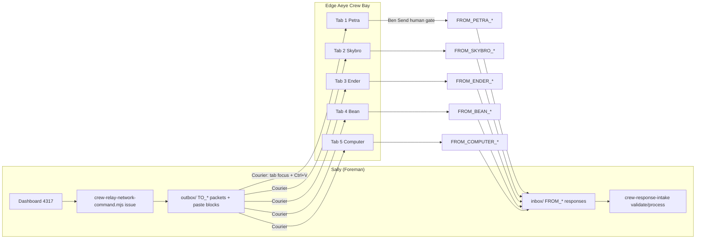

# AEYE Edge Network Relay

How the **first command** crosses the Edge network so every Aeye cousin knows their role.

## Architecture



**No arrow crosses Send automatically.** `autoSend: false` in `crew-tabs.config.json`.

---

## First command: `ROLE_AWARENESS_SYNC`

| Field | Value |
|-------|-------|
| Command ID | `ROLE_AWARENESS_SYNC` |
| Version | `v0.1` |
| Purpose | Every Edge cousin acknowledges lane, relay doctrine, and network map |
| Role cards | `foreman/crew-dispatch/crew-network-roles.json` |
| Manifest | `foreman/crew-dispatch/LATEST_NETWORK_COMMAND.json` |

### Issue (Sally)

```powershell
node foreman/crew-dispatch/crew-relay-network-command.mjs issue
```

Or Foreman dashboard → **Issue Role Awareness Sync**

Creates:

- `foreman/handoffs/outbox/RELAY_NETWORK_ROLE_AWARENESS_SYNC_v0.1_<timestamp>.md` — operator walkthrough
- `foreman/handoffs/outbox/TO_{COUSIN}_RELAY_ROLE_AWARENESS_SYNC_v0.1_<timestamp>.md` — full packet per cousin
- `foreman/handoffs/outbox/{COUSIN}_NETWORK_PASTE_BLOCK.txt` — short paste for Edge tab
- `foreman/crew-dispatch/LATEST_NETWORK_COMMAND.json` — machine manifest

### Walk Edge tabs (Ben)

1. **Open Aeye Crew Bay** (if not open — Deliver Petra opens bay automatically)
2. Dashboard → **Walk Network Sync (auto-paste all 5)**  
   OR per cousin → **Deliver {Name}**
3. Review paste in each tab → **Send** (Ben only)
4. Walk prompts: Enter = next cousin
5. Save each reply as `FROM_{COUSIN}_RELAY_ROLE_ACK_*.md` in inbox
6. Dashboard → **Validate Inbox** → **Process Responses**

### CLI courier

```powershell
node foreman/crew-dispatch/crew-edge-courier.mjs deliver --cousin PETRA --ensure-edge
powershell -NoProfile -ExecutionPolicy Bypass -File foreman/crew-dispatch/crew-edge-courier.ps1 -WalkNetworkSync -EnsureEdge
```

**Automated:** tab focus, clipboard, Ctrl+V  
**Still manual:** Send, save replies, merge to repo

### Show latest

```powershell
node foreman/crew-dispatch/crew-relay-network-command.mjs show
node foreman/crew-dispatch/crew-relay-network-command.mjs show --cousin BEAN
```

---

## Cousins vs Sally-only agents

| Seat | Edge tab | Relay paste loop |
|------|----------|------------------|
| Petra | 1 | yes |
| Skybro | 2 | yes |
| Ender | 3 | yes |
| Bean | 4 | yes |
| Computer | 5 | yes |
| Codex / Foreman | — | repo handoffs on Sally |
| Maker / Cursor | — | waits for Petra; not Edge paste |

---

## Related

- `CREW_RELAY_README.md` — hash, intake, outbox lifecycle
- `EDGE_DISPATCH_BAY.md` — tab order and launcher
- `AI_COUSINS_PROTOCOL.md` — full cousin reading lists
- `crew-packet-schema.json` — response validation
